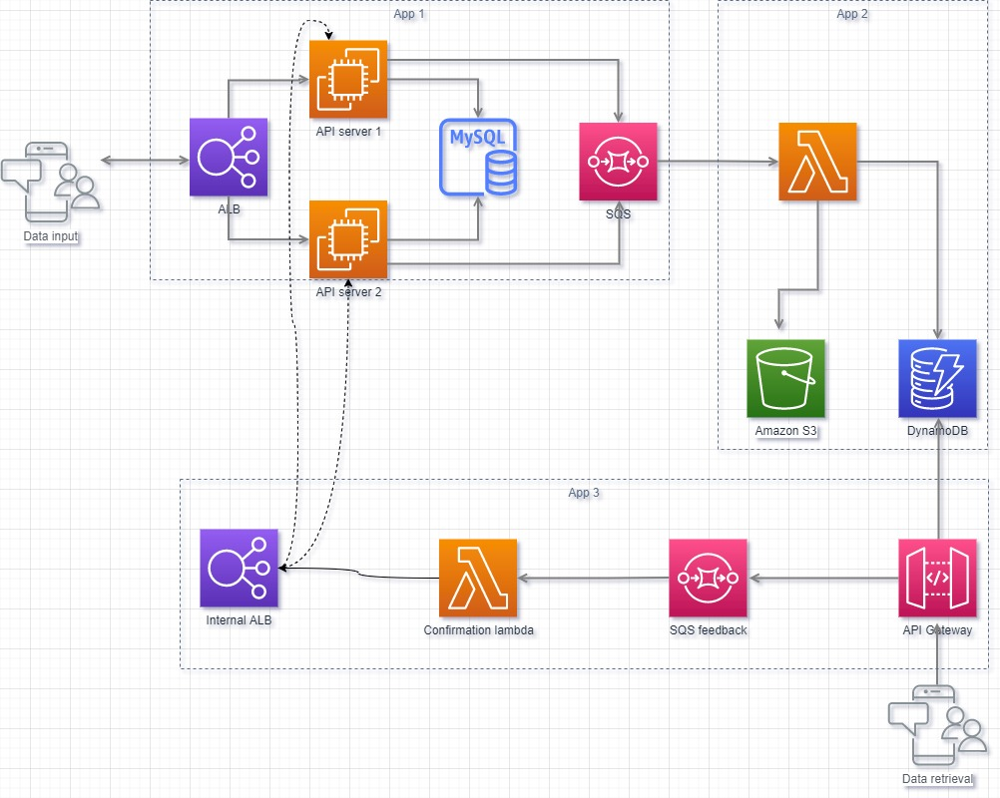

# Data synker (pull model)

Small system for sandboxing a data synchronization using Java, Spring Boot and AWS

## 1. Intro

This project is composed by 3 modukes:

a) [Data ingestion API](data-ingestion-api/)

b) Data stage system

c) Data updates API

d) [AWS utils](ds-aws-util/)

The first module as the name suggests is used to receive data updates (creation and updates) and for the sake of the exercise it simulates an really, really simple invoice management system.

The second module has the responsability to receive and stage the modifications so they can be retrieved by an external entity through the updates API.

The third and final module is used to retrieve updates and when they are confirmed by the external user, this module feeds it back to the first module.

Below you can see a diagram of the original design for this sandbox project:

**This is a sandbox project for practicing some AWS services and using different programming languages for such distributed system.**

## 2. Tech stack

Here are the technologies used (so far):

- AWS EC2, RDS (PostgreSQL), SQS, S3
- Gradle, Java 11, Spring Boot, Spring Boot Actuator, Spring Data JDBC
- Docker
- Gitflow
- Swagger (for API specifications)